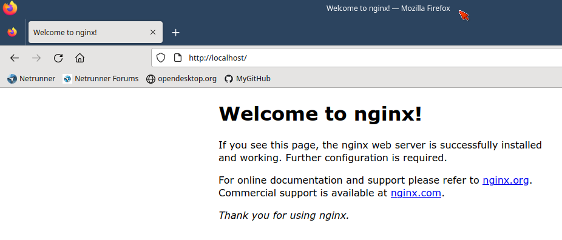
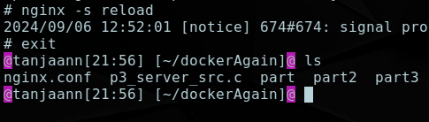

### [Преамблуа](#preamblua)
#### [Part 0 - Установка](#part-0)
#### [Part 1 - Готовый Докер](#part-1)
#### [Part 2 - Операции с контейнером](#part-2)
#### [Part 3 - Мини веб-сервер](#part-3)
#### [Part 4 - Свой докер](#part-4)
#### [Part 5 - Dockle](#part-5)
#### [Part 6 - Базовый Docker Compose](#part-6)

---
---

## Чо за Docker?

- Докер использует виртуализацию на уровне ОСи, и создаёт различные контейнеры, которые изолированны друг от друга.

- Докер позволяет запихнуть приложение со всеми своими зависимостями (библиотеками типо) в стандартизированный пэкэдж в целях разработки софта

- Это open source платформа которая автоматизирует деплой, масштабирование, и мэнеджмент приложений внутри контейнеров.

- Является стандартом индустрии для контейнеризации., но не является единственным.

- Этот подход упрощает процесс деплоя приложений между различными ОСями, версиями ОСей, различными окружениями.

- **Кароч он для теста приложухи твоей, шоб оно и на яблоках, и на линуксах, и в винде фурычило нормас~**

--- 

- **Docker Hub**
    - Это облачный репозиторий.. центральный хаб где различные люди и/или организации распространяют свои контайнизированные приложения.
    
    - в Докер Хабе можно хранить как публичные так и приватные репозитории

    - Ключевые фичи Докер Хаба:
        - **Система Репозиториев**: в которой юзеры могут пушить и пулить контейнер образы.
        - **Автоматизированные билды**: Докер Хаб может интегрироваться с **GitHub** чтобы автоматом билдить и запускать твой код
        - **Webhooks** позволяет триггерить действия после успешного пуша в репо. Тоесть, позволяет интегрироваться с другими сервисами (для тестов, деплоя, и тд)
        - **Проверки безопасности**, Докер Хаб проверяет всё на вирусы и вулнарабилитиз (уязвимости)
        - **Контроль Доступа**, позволяет настроить его. bruh

    - **Эт кароч хаб где кууучи контейнеров в различных энвайроментах.**

---

- Основные понятия в **Docker**:
    - **Образ(Image)** это как-бы "установочный файл", его нельзя запустить, но можно на его основе создать контейнер.
    - **Контейнер(Container)** - экземпляр образа, "живой" образ. Тоесть в контейнере уже чтото лежит и готово к запусуку

- Предшественником **Docker** были виртуальные машины, они точно так же изолируют приложение от внешней среды. 
    - Но они лучше. Чем?
        - Потребляют меньше ресурсов машины
        - Их очень легко переносить
        - Они быстрее запускаются

- Докер образ также состоит из **слоёв**. Эта *слоевитость* играет ключевую и важную роль в процессе работы докера.

    - Слои, что это такое?
        - По сути это снэпшоты состояний файловой системы в определённых состояниях.
        - Каждый слой имеет свои конкретные конфиги и настройки, изменения в файловой системе.
        - Также - если слой создан, то он уже не может быть изменён. Это свойство неименяемости гарантирует неименяемость в разных системах, и сохранность образа.
    
    - Преимущества такой системы?
        - Эффективность, layer system позволяет переиспользовать неизменённые слои, и соответственно ускорить билдинг процесс. Только изменённые слои нужно будет ребилдить, что и сохраняет ресурсы и время. (прям как в git)

        - Занимает меньше места из-за своей логики **слоеизации**

---

Для создания образа используется **Dockerfile**, и каждая инструкиця в этом файле создаёт новый слой

---

## Список команд/флагов у **docker**:
- **docker pull [имя_образа]** - скачать образ
- **docker run [имя_образа]** - создать и запустить контейнер из образа
- **docker images** - показать образы
- **docker ps** - показать только активные контейнеры
- **docker ps -a** - показать все контейнеры, и выключенные и включенные
> Важно отметить что образы и контейнеры это разные штуки.
- **docker build .** - забилдить образ из Dockerfile
- **docker export** - экспортировать контейнер в архив, отдельный файл.
- **docker kill** - остановить включенный контейнер
- **docker logs [имя_образа]** - показать логи, ошибки и прочее от контейнера. Поможет если контейнер запускается и сразу же выключается
- **docker restart [имя_образа]** - включить/перезапустиить контейнер
- **docker rm [имя_контейнера]** - удалить контейнер
- **docker rmi [имя_образа]** - удалить образ
---
- **docker cp** - скопировать файл на контейнер
    - **docker cp ./aaa.txt mydocker:/home/user/Downloads/aaa.txt** 
        - Например скопирует файл "aaa.txt" из текущей папки в папку "Downloads" на контейнере "mydocker" 
- **docker exec** - запустить команду в запущенном образе
    - **docker exec -it mydocker sh** 
        - Например, запускает консоль (bash, sh) в интерактивном режиме (-it) на контейнере, что позволит прожимать команды прямо во включённом образе

---

## Что такое Dockle?

- Это инструмент для проверки безопасности образов контейнеров, что-то типо флага **-pedantic** при компиляции с **gcc**, ну или линтера. 
- В сути своей это проверка контейнера на уязвимости и утечки данных, и прочие ошибки

## Что такое **nginx**?
- Это open source софт для веб серверов, известный своей эффективностью, стабильностью, и набором фич. 
- Он поддерживает не только **HTTP** протокол, но и **IMAP, POP3, SMTP**, (эти трое это EMAIL протоколы)
- Обычно работа **nginx** определяется файлом конфига, и этот файл конфига обычно лежит по пути:
    - **Linux**: 
        - /etc/nginx/**nginx.conf**
    

## Part 0. Установка ВМки

- В этом проекте можно юзать любой Линукс, поэтому можно скачать самый стандартный Ubuntu, или Debian, по желанию

- Затем устанавливаем **docker** через:
    - **sudo snap install docker**

- Версия докера на которой буду делать это задание:
    - 

- И начинаем выполнять задание..

## Part 1. Готовый докер

##### Беру официальный докер-образ с nginx и пуллю его
- Исспользуя команду:
    - **docker pull nginx** \
    - 
        - Кстати, **все команды связанные с докером надо прожимать с sudo**, 
        - Или же зайти под **root** через **sudo su**
---
##### Проверяю наличие докер-образа
- Используя команду:
    - **docker images** \
    - 

---

##### Запускаю докер образ
- Используя команду:
    - **docker run -d --name mydocker nginx:latest** \
    - 

    - Что за команда и что за флаг?
        - Команда запускает докер на основе образа
        - **-d** (detached mode) запускает его фоновым процессом и не лочит терминал
        - **--name** позволяет назвать контейнер по своему, а не получать рандомное имя

---

##### Проверяю, что образ запустился через
- Используя команду:
    - **docker ps**
- В прошлом скриншоте уже проверил

---

##### Смотрю информацию о контейнере
- Используя команду:
    - **docker inspect mydocker** \
    - 

---

##### По выводу команды определи и помести в отчёт размер контейнера, список замапленных портов и ip контейнера.
- Используя команду:
    - **docker inspect --size mydocker | grep -i -e Size -e ExposedPorts -e IPAddress -C 1**
        - Что за флаги?
            - **--size** добавляет доп информацию
            - **-i** у **grep** добавляет ignore case, регистр букв в паттерне игнорирует
            - **-C 1** у **grep** расширяет найденный вывод на 1 строку вверх и вниз \
            - **-e** у **grep** добавляет паттерны для поиска

    - 

- **SizeRw** представляет собой размер изменений внесённых в образ
- **SizeRootFs** это общий размер файлов в контейнере
- **ExposedPorts** порты
- **IPAddress** это айпишник

---

##### Остановавливаю докер образ
- Через команду:
    - **docker stop ###**
    - 
        - Ну и через **docker ps -a** сразу проверяю выключился ли он
---
##### Запускаю докер:
- Но с портами **80** и **443** в контейнере, замапленными на такие же порты на локальной машине, через команду:
    - **docker run -d --name p1_docker -p 80:80 -p 443:443 nginx:latest** \
    - Чо за флаги?
        - **-d** запуск фоновым процессом
        - **--name** чтоб назвать по своему, в этот раз **p1_docker**
        - **-p [hostPort]:[containerPort]** число слева это порт **хоста** а справа это порт **контейнера**
    - 
---
##### Проверяю что в браузере по адресу *localhost:80* доступна стартовая страница **nginx**.

- Я порт вводил! Он чтот пропадает почемут из адресной строки браузера~
    - 
- Альтернативно, можно проверить эту страничку через **curl** командой:
    - **curl localhost:80**
    - 

---
##### Перезапускаю докер контейнер
- Используя команду:
    - **sudo docker restart ###** \
    - И сразу проверяю что он работает командой 
        - **docker ps**
    - 

## Part 2. Операции с контейнером

##### Прочитай конфигурационный файл nginx.conf внутри докер контейнера через команду exec.
- Получается командой:
    - **sudo docker exec p1_docker cat /etc/nginx/nginx.conf**
    - 

##### Создаю на локальной машине файл *nginx.conf*.
- Очень удобно просто использовать оператор перенаправления чтобы создать этот файл на ВМке
    - *sudo docker exec p1_docker cat /etc/nginx/nginx.conf* **> nginx.conf**
    - 

- Затем нужно добавить вывод странички **/status** и можно удалить лишнее:
    - Редактируем файл на **ВМке**, любым редактором:
    - 

---

##### Копирую созданный файл *nginx.conf* внутрь докер-образа 
##### Перезапускаю **nginx** внутри докер-образа через команду *exec*. \
- Через команды:
    - **sudo docker cp nginx.conf p1_docker:/etc/nginx/** 
    - **sudo docker exec p1_docker nginx -s reload**
    - 
    
---

- Альтернативно, **можно зайти внутрь докера** через:
    - **sudo docker exec -it p1_docker sh**
        - **-it** флаг означает интерактивный режим, тоесть без этого терминал(sh) не будет доступен
    - И просто прожать:
        - **nginx -s reload**
    - 
    - Результат одинаковый что так что эдак~

---
##### Проверяю, что по адресу *localhost:80/status* отдается страничка со статусом сервера **nginx**.
- Захожу через браузер и вижу: \
    - 

- Альтернативно, можно через curl:
    - **curl localhost:80/status**
    - 
---
##### Экспортирую контейнер в файл *container.tar* через команду:
- **sudo docker export p1_docker > container.tar** \
    - 

---
##### Останови контейнер.
- Останавливать можно безопасно и с силой (**graceful** and **forced**)
    - **sudo docker stop p1_docker** \
    - 
        - В данном случае происходит безопасный выход, с сохранением данных и корреткным выключением. **Но ожидание в 10 секунд**

    ---

    - **sudo docker kill p1_docker**
        - В этом форс выключении выход происходит мгновенно, что может (а может и не можэет) иметь последствия.

---
##### Удали образ, не удаляя перед этим контейнеры, через команду:

- **sudo docker rmi --force ###** \
    - 

---
##### Удали остановленный контейнер.
- Можно использовать команду:
    -**sudo docker container prune -f**
    - Чтобы удалить все остановленные контейнеры одной командой сразу

- Но нам скорее нужно точечное удаление, тогда подходит команда:
    - **sudo docker rm p1_docker** \
    - При этом смотрю успешно ли удалилось через:
        - **sudo docker ps -a**
    - 

---
##### Импортируй контейнер обратно
- Через команду:
    - **sudo docker import container.tar** 

- 
- При этом через данные команды я смотрел:
    - **docker images** - то что образов нету до импорта
    - **ls** - то что я нахожусь в папке с **container.tar**
    - **docker docker container.tar** - производится сам импорт
    - **docker images** - смотрим что он действительно импортировался

---

##### Запусти импортированный контейнер.
- Через прожатие команды:
    - **docker run --name p2_docker -d -p 80:80 ### nginx -g 'daemon off;'** \
    - 
    - Что за **nginx -g 'daemon off;'?
        - **-g 'daemon off;'** *global directive*, о том что *daemon off*
        - Тоесть запуск нгинкса не фоновым процессом а "главным", для более корректной и безошибочной работы

---

##### Проверяю, что по адресу *localhost:80/status* отдается страничка со статусом сервера **nginx**.
- Через браузер на ВМке :
    - 
- Альтеративно через curl:
    - 

## Part 3. Мини веб-сервер

> Если при попытке включить/перезапустить docker образ который в состоянии **Exited** появляется ошибка:    
>   - **error bind: address already in use**
>      - То надо через команду 
>        - **sudo lsof -i -P -n** 
>        - Найти процесс который юзает этот порт (в моём случае это был apache2) и выключить его по PID командой:
>           - **sudo kill %ID%**

---

##### Для начала, желательно создать новый контейнер
- Через команду:
    - **sudo docker run --name p3_docker -d -p 81:81 nginx:latest**
    - Почему порты 81:81? Так сказано по заданию.
    - 

##### Напиши мини-сервер на **C** и **FastCgi** который будет возвращать простейшую страничку с надписью `Hello World!`.

- Создаю файлик на языке **си** \
    - 
    - название произвольное, но я назвал:
        - **p3_server_src.c**

- Копирую его на **контейнер** 
    - **sudo docker cp p3_server_src.c p3_docker:/etc/nginx/**  \
    - 

---

- Далее заходим в терминал внутри докера, через:
    - **docker exec -it p3_docker sh**
    - 
        - **-it** interactive, без этого флага терминал будет неИнтерактивен

    - Обновляю список приложений,
    - И скачиваю нужные библиотеки для поднятия мини-сервера
        - **apt-get update**
        - **apt-get install libfcgi-dev -y**
        - **apt-get install spawn-fcgi -y**
        - **apt-get install gcc -y**
        - 

---

##### Запускаю написанный мини-сервер через *spawn-fcgi* на порту 8080.

- Также находясь в интерактивном режиме sh внутри docker'a
- Прожимаю:
    - **cd /etc/nginx**
    - **gcc p3_server_src.c -lfcgi -o server.o**
    - **spawn-fcgi -p 8080 server.out** \
    - 

---
##### Пишу свой *nginx.conf*, который будет проксировать все запросы с 81 порта на *127.0.0.1:8080*.

- Придётся выйти из интерактивного режима через:
    - **exit**
    - 
---
- И добавить в **nginx.conf**:
    > listen 81; \
    > location / { \
    >   fastcgi_pass 127.0.0.1:8080; \
    > }
---
- Итоговый nginx.conf выглядит так:
    - 

- Дальше его надо скопировать внутрь контейнера:
    - **docker cp nginx.conf p3_docker:/etc/nginx**
    - 
---

- Ну и перезапустить всё это дело:
    - Можно через 
        - **docker exec p3_docker spawn-fcgi -p 8080 /etc/nginx/server.o**
        - **docker exec p3_server nginx -s reload**
    - А можно зайти внутрь контейнера и прожать там:
        - **docker exec -it p3_docker sh**
        - **spawn-fcgi -p 8080 /etc/nginx/server.o**
        - **nginx -s reload**
    - 

---
##### Проверь, что в браузере по *localhost:81* отдается написанная тобой страничка.

- Захожу на ВМ-ке через браузер на **localhost:81** \
    - 
- Альтернативно можно через curl:
    - **curl localhost:81**
    - 

##### Положи файл *nginx.conf* по пути *./nginx/nginx.conf* (это понадобится позже).
- Положил 

## Part 4. Свой докер

*При написании докер-образа избегай множественных вызовов команд RUN*

#### Пишу свой докер-образ, который:

##### 1) собирает исходники мини сервера на FastCgi из Part 3

##### 2) запускает его на 8080 порту;

##### 3) копирует внутрь образа написанный *./nginx/nginx.conf*;

##### 4) запускает **nginx**.

- Вообщем говоря, делаем **то же самое** что и в [Part 3] но через **Dockerfile**
    - Создаём его в той же папке где лежит и **nginx.conf** и **p3_server_src.c**
    - **Dockerfile** будет выглядеть вот так:
    - 
        - Что за команды?
            - **FROM** указывает из какого образа собирать
            - **USER** указывает от какого юзера делать команды
            - **COPY** копирует файл, первым аргументом указываешь локальный файл(который рядом с Dockerfile лежит), а через пробел где оно будет лежать **внутри контейнера**
            - **RUN** запускает команды
                - в нашем случае это обновление списка apt-get и установка gcc, spawn-fcgi, libfcgi-dev

            - **WORKDIR** указывает рабочую папку, место откуда будут запускаться команды из **ENTRYPOINT**.
            - **ENTRYPOINT** команды или скрипты которые будут запущены после запуска контейнера или его перезапуска
---
##### Собери написанный докер-образ через `docker build` при этом указав имя и тег.

- Через команду:
    - **sudo docker build -t [name:tag] .**
        - да, точка тут важна. Создаёт на основе **Dockerfile** из этой папки~

    - Билд в процессе \
    - 

    - Сообщение об успехе \
    - 

---
##### Проверь через `docker images`, что все собралось корректно.
- Проверяю, всё есть: \
    - 

---
##### Запусти собранный докер-образ с маппингом 81 порта на 80 на локальной машине и маппингом папки *./nginx* внутрь контейнера по адресу, где лежат конфигурационные файлы **nginx**'а.

- Эээ, кароч командой: 
    - **sudo docker run --name p4_container -d -p 80:81 p4_image:fromDockerfile** \
    - 

---
##### Проверь, что по localhost:80 доступна страничка написанного мини сервера.
- Угу открывается: \
    - 
- И через **curl** тоже: \
    - 

---
##### Допиши в *./nginx/nginx.conf* проксирование странички */status*, по которой надо отдавать статус сервера **nginx**.
- Ээээ я так и оставил его с прошлого задания..

---
##### Перезапусти докер-образ.

- Командой:
    - **docker restart p4_container**
    - 

---
##### Проверь, что теперь по *localhost:80/status* отдается страничка со статусом **nginx**
- Открывается и через браузер:
    - 
- И через **curl**:
    - 

## Part 5. **Dockle**

- Как его установить ваще?
    - На **MacOS** это легко, прост через **brew**
    - На **Ubuntu** ж надо зайти на:
        - **https://github.com/goodwithtech/dockle?tab=readme-ov-file#installation**
    - И там найти как установить. В моём случае это было через: \
    - 
    - Оно чёто там ругалось на $, но прост убираешь этот доллар и устанавливается изи~
    - Вот кстати его версия на момент моего выполнения:
    - 

---

##### Просканируй образ из предыдущего задания через `dockle [image_id|repository]`.

- ### Скан с ошибками: \
    - Через команду:
        - **sudo dockle [image_name:tag]**
        - 

##### Исправь образ так, чтобы при проверке через **dockle** не было ошибок и предупреждений.

---
- **CIS-DI-0005: Enable Content trust for Docker** чтоб это исправить надо сделать что-то из этого:
        - Удаляем образы (images) через:
            - **docker rmi nginx:latest**
            - **docker rmi nginx:stable**
        - Затем прожимаем:
            - **export DOCKER_CONTENT_TRUST=1**
        - Потом заново **docker pull nginx** и тогда всё оки чики-пуки
    
    - Или же помогло то что я зашёл в **root** через команду **sudo -su** и прожал **export DOCKER_CONTENT_TRUST=1**? Какойто прикол был в общем связанный с тем что **export** делаем из под обычного юзера без прав на смену этой переменной
    
---
- **CIS-DI-0010: Do not store credential in environment variables/files** эта ошибка исправляется добавлением строчки при вызове **dockle**
    - **dockle -ak NGINX_GPGKEY -ak NGINX_GPGKEY_PATH [###:###]**

---
- **DKL-DI-005: Clear apt-get caches** устраняется добавлением строчки в Dockerfile
    - **rm -rf /var/lib/apt/lists**

---
- **CIS-DI-0001: Create a user for the container** испрявляется добавлением юзера командой в Dockerfile
    - **useradd [name]**

---
- **CIS-DI-0006: Add HEALTHCHECK instruction to the container image** испрявляется добавлением цели HEALTHCHECK в Dockerfile

---
- **CIS_DI-0008: Confirm safety of setuid/setgid files** исправляется тоже прожатием команд доступа в Dockerfile, нужно заметить что права где-то **g-s** а где то **u-s**

---
- Можно также добавить к вызову **dockle** флаг -i (ignore) и код ошибки, чтобы игнорировать её. Это не исправление как таковое, но по заданию ведь нужно чтобы **dockle** не ругался, правда?
    - Пример использования:
        - **dockle -ak NGINX_GPGKEY -ak NGINX_GPGKEY_PATH -i CIS-DI-0005 [###:###]**

- Исправленный **Dockerfile** \
    - 

- Билдю через команду:
    - **sudo docker build -t [image_name:tag] .** \

- Проверяю заного:
    - 

- Как же пофиксить эти две ошибки?
    - **TODO**

## Part 6. Базовый **Docker Compose**

- В этой части очень поможет утилита **yamllint** которую можно установить и чекать **docker-compose.yml** файлик онлайн, через одноимённый веб-сайт. 

- Что такое docker compose? В чём смысл?
    - Это как Dockerfile для Dockerfile'ов, инструмент для запуска мульти-контейнеров.
    - Позволяет запускать/останавливать несколько контейнеров сразу.
---

- **docker-compose up:**
    - Это команда запуска того что написано в **docker-compose.yml**, по сути она:
        - Билдит образы (images)
        - Создаёт контейнеры (containers)
        - Запускает контейнеры. Запускает все контейнеры паралельно, если нет директивы "depends_on"
        - Начинает вести логи о состоянии сразу на консоль/терминал
            - Можно запускать через **docker-compose up -d** в detached режиме~

---
##### Напиши файл *docker-compose.yml*, с помощью которого:
##### 1) Подними докер-контейнер из [Части 5]

##### 2) Подними докер-контейнер с **nginx**, который будет проксировать все запросы с 8080 порта на 81 порт первого контейнера.
##### Замапь 8080 порт второго контейнера на 80 порт локальной машины.
- Написанный **yml** файл \

---
##### Останови все запущенные контейнеры.
- Командой:
    - **sudo docker stop $(docker ps -a -q)** \

---
##### Собери и запусти проект с помощью команд `docker-compose build` и `docker-compose up`.
- Прожимаю команды \

---
##### Проверь, что в браузере по *localhost:80* отдается написанная тобой страничка, как и ранее.

### EOF